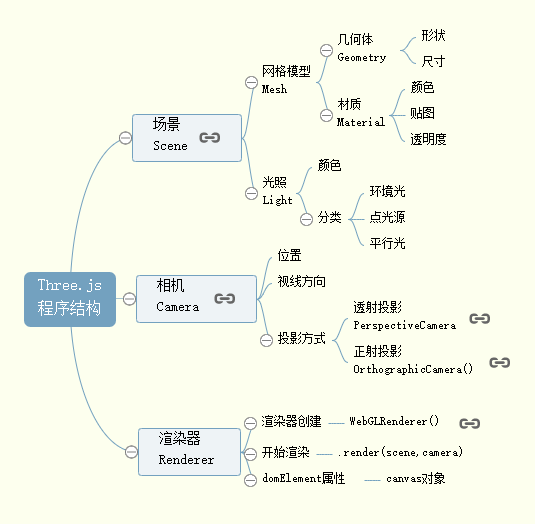

# three.js

## three.js 介绍

threejs是一个让用户通过javascript入手进入搭建webgl项目的类库。
作为笔记，不做复制粘贴官方文档的蠢事，只记录使用过程中遇到的些许问题和实现功能的方法。

### 树状结构图

场景Scene、相机Camera、渲染器Renderer缺一不可。  



### 基础demo

``` js
//初始化场景
let scene = new THREE.Scene();
//初始化相机
let camera = new THREE.PerspectiveCamera(75, window.innerWidth / window.innerHeight, 0.1, 1000);
//初始化渲染器
let renderer = new THREE.WebGLRenderer();
renderer.setSize(window.innerWidth, window.innerHeight);
document.body.appendChild(renderer.domElement);

//创建几何体
let geometry = new THREE.BoxGeometry(1, 1, 1);
//初始化材质
let material = new THREE.MeshBasicMaterial({
    color: 0x00ff00
});
//生成模型
let cube = new THREE.Mesh(geometry, material);
//向场景添加已创建的几何体模型
scene.add(cube);

//设置相机位置
camera.position.z = 5;

let animate = function() {
    requestAnimationFrame(animate);
    // 旋转  
    cube.rotation.x += 0.01;
    cube.rotation.y += 0.01;
    //渲染
    renderer.render(scene, camera);
};
//执行 animate
animate();
```

## Scene

### 雾化效果

``` js
//初始化场景
let scene = new THREE.Scene();

//设置雾化效果
const BACKGROUND_COLOR = 0xffffff;
scene.fog = new THREE.Fog(BACKGROUND_COLOR, 20, 100);
```

[雾（Fog）](https://threejs.org/docs/index.html#api/zh/scenes/Fog)

### 背景

``` js
//初始化场景
const BACKGROUND_COLOR = 0xffffff;
let scene = new THREE.Scene();

//1、纯色背景
scene.background = new THREE.Color(BACKGROUND_COLOR);
//2、图片背景
let textureLoader = new THREE.TextureLoader();
let textureEquirec = textureLoader.load('./static/img/bg.jpg');
textureEquirec.mapping = THREE.EquirectangularReflectionMapping;
textureEquirec.encoding = THREE.sRGBEncoding;

scene.background = textureEquirec;
```

### 全景贴图

``` js
//初始化场景
let scene = new THREE.Scene();
//全景贴图
let textureLoader = new THREE.TextureLoader();
let textureEquirec = new THREE.CubeTextureLoader()
    .setPath('./static/img/')
    .load(['virtuell_l2_px.jpg', 'virtuell_l2_nx.jpg', 'virtuell_l2_py.jpg', 'virtuell_l2_ny.jpg', 'virtuell_l2_pz.jpg', 'virtuell_l2_nz.jpg']);
textureEquirec.mapping = THREE.EquirectangularReflectionMapping;
textureEquirec.encoding = THREE.sRGBEncoding;

scene.background = textureEquirec;
```

[全景示例1](https://threejs.org/examples/webgl_materials_envmaps.html)
[全景示例2](https://www.zwetdesign.com/wp-content/themes/boiler-theme/realtime/room/#mobile)

## Renderer

``` js
let renderer = new THREE.WebGLRenderer(
    animation: true,
    antialias: true,
    // preserveDrawingBuffer: true, //是否保留缓直到手动清除或被覆盖
);
renderer.setSize(window.innerWidth, window.innerHeight);
renderer.setPixelRatio(window.devicePixelRatio);
document.body.appendChild( renderer.domElement );
```

::: tip preserveDrawingBuffer
当需要实现一个截屏功能时（当前canvas），网上多数的解决方案是设置 `preserveDrawingBuffer：true` ，然后使用 `toDataURL()` 方法来实现截图。
这样设置会遇到低性能的安卓设备卡顿问题。

解决方案：在截图前调用 `renderer.render(scene, camera)` 手动触发一次渲染。然后使用 `toDataURL()` 截图。
:::
[WebGLRenderer](https://threejs.org/docs/index.html#api/zh/renderers/WebGLRenderer)


## 光源

#### AmbientLight 环境光   
环境光会均匀的照亮场景中的所有物体。  
- 不支持阴影。  

[AmbientLight](https://threejs.org/docs/index.html#api/zh/lights/AmbientLight)  

#### DirectionalLight 平行光  
平行光是沿着特定方向发射的光。这种光的表现像是无限远,从它发出的光线都是平行的。常常用平行光来模拟太阳光 的效果; 太阳足够远，因此我们可以认为太阳的位置是无限远，所以我们认为从太阳发出的光线也都是平行的。 
- 可以投射阴影    

[DirectionalLight](https://threejs.org/docs/index.html#api/zh/lights/DirectionalLight)


#### HemisphereLight 半球光  
半球光直接放置于场景之上，光照颜色从天空光线颜色颜色渐变到地面光线颜色。  
- 不支持阴影。

[HemisphereLight](https://threejs.org/docs/index.html#api/zh/lights/HemisphereLight)

#### PointLight 点光源  
从一个点向各个方向发射的光源。一个常见的例子是模拟一个灯泡发出的光。   
- 可以投射阴影     

[PointLight](https://threejs.org/docs/index.html#api/zh/lights/PointLight)

#### RectAreaLight 平面光  
平面光光源从一个矩形平面上均匀地发射光线。这种光源可以用来模拟像明亮的窗户或者条状灯光光源。  
- 不支持阴影。
- 只支持 `MeshStandardMaterial` 和 `MeshPhysicalMaterial` 两种材质。
- 你必须在你的场景中加入 `RectAreaLightUniformsLib` ，并调用`init()`。  

[RectAreaLight](https://threejs.org/docs/index.html#api/zh/lights/RectAreaLight)

#### SpotLight 聚光灯  
光线从一个点沿一个方向射出，随着光线照射的变远，光线圆锥体的尺寸也逐渐增大。  
- 可以投射阴影    

[SpotLight](https://threejs.org/docs/index.html#api/zh/lights/SpotLight)

## OrbitControls

Orbit controls（轨道控制器）可以使得相机围绕目标进行轨道运动。

``` js
let controls = new THREE.OrbitControls(
    camera,
    renderer.domElement //默认body，设置控制范围renderer.domElement
);
controls.minPolarAngle = Math.PI * (0 / 180);
controls.maxPolarAngle = Math.PI * (90 / 180);

controls.enableDamping = true; //阻尼 惯性
controls.dampingFactor = 0.1; //阻尼系数
controls.enablePan = false;
//controls.autoRotate = true;
controls.zoomSpeed = 1;
controls.rotateSpeed = 0.1;
controls.autoRotateSpeed = 0.2;

function animate() {
    requestAnimationFrame(animate);
    // required if controls.enableDamping or controls.autoRotate are set to true
    controls.update();
    renderer.render(scene, camera);
}
```

[OrbitControls](https://threejs.org/docs/index.html#examples/zh/controls/OrbitControls)

## 加载3D模型

目前，3D模型的格式有成千上万种可供选择，但每一种格式都具有不同的目的、用途以及复杂性。 虽然 three.js已经提供了多种导入工具， 但是选择正确的文件格式以及工作流程将可以节省很多时间，以及避免遭受很多挫折。某些格式难以使用，或者实时体验效率低下，或者目前尚未得到完全支持。

### FBX格式示例

``` js
import {
    FBXLoader
} from 'three/examples/jsm/loaders/FBXLoader.js';

let loader = new FBXLoader();

loader.load(
    'path/to/model.fbx',
    (mesh) => {
        scene.add(mesh);
    },
    (xhr) => {
        // 加载进度条
        console.log(xhr);
        this.percent = parseInt((xhr.loaded / xhr.total) * 100);
        // console.log( ( xhr.loaded / xhr.total * 100 ) + '% loaded' );
    },
    (error) => {
        console.log(error);
    });
```

### 模型动画

``` js
//  AnimationMixer 动画混合器是用于场景中特定对象的动画的播放器。当场景中的多个对象独立动画时，每个对象都可以使用同一个动画混合器。
mixer = new THREE.AnimationMixer(mesh);

for (let i = 0; i < mesh.animations.length; i++) {
    //  clipAction 返回所传入的剪辑参数的AnimationAction, 根对象参数可选，默认值为混合器的默认根对象。
    let action = mixer.clipAction(mesh.animations[i]);
    action.stop();
}
//  第一个参数可以是动画剪辑(AnimationClip)对象或者动画剪辑的名称。
mixer.clipAction(mesh.animations[0]).play();
```

### 自动缩放

模型尺寸不统一的情况下，需要动态设置缩放系数来展示模型。

``` js
// 缩放系数计算
let box = new THREE.Box3();
box.expandByObject(mesh);

let length = box.max.x - box.min.x;
let width = box.max.z - box.min.z;
let height = box.max.y - box.min.y;

let max;
if (length > width) {
    max = length;
} else {
    max = width;
}
if (max < height) {
    max = height;
}
let zoom = 6 / max;
mesh.scale.set(zoom, zoom, zoom);
```

### 自动居中

模型中心位置不统一的情况下，需要自动居中模型。

``` js
// 位置自动居中
let box = new THREE.Box3();
box.expandByObject(mesh);
let center = new THREE.Vector3();
box.getCenter(center);
// mesh 中心坐标点偏移计算
mesh.position.x = mesh.position.x - center.x;
mesh.position.y = mesh.position.y - center.y;
mesh.position.z = mesh.position.z - center.z;
```

### 模型标注


当需要给3D模型添加尺寸标注时

#### 画线

``` js
// 线材质
let material = new THREE.LineBasicMaterial({
    color: 0x0000ff
});
// 线段各个点array
let points = [];
points.push(new THREE.Vector3(-10, 0, 0));
points.push(new THREE.Vector3(0, 10, 0));
points.push(new THREE.Vector3(10, 0, 0));
//连点成线，生成线段
let geometry = new THREE.BufferGeometry().setFromPoints(points);
let line = new THREE.Line(geometry, material);

// 添加至场景，渲染
scene.add(line);
renderer.render(scene, camera);
```

#### 文字

``` js
//文字
let loader = new THREE.FontLoader();
loader.load(
        './static/fonts/helvetiker_regular.typeface.json',
        font => {
            let txtMater = new THREE.MeshBasicMaterial({
                color: 0xfb962e
            });
            // 宽文字
            let textGeo = new THREE.TextGeometry(size.width, {
                font: font,
                size: 70,
                height: 0.1,
                curveSegments: 12,
                bevelEnabled: false,
                bevelThickness: 20,
                bevelSize: 8,
                bevelSegments: 3
            });
            widthTextMesh = new THREE.Mesh(textGeo, txtMater);
            // 在3D模型上添加文字，文字也需要同步进行缩放，zoom和模型缩放系数一样。
            widthTextMesh.scale.set(zoom, zoom, zoom);
            // // 文字需要居中，因此计算文字模型的宽度，然后调整偏移文字模型position.x的值
            // let textBox = new THREE.Box3();
            // textBox.expandByObject(widthTextMesh);
            // let textWidth = textBox.max.x - textBox.min.x

            // widthTextMesh.position.set(-textWidth/2, box.max.y, 0);

            scene.add(widthTextMesh);
        }
```

### 模型阴影

如果需要给模型添加阴影，首先渲染器开启阴影

``` js
renderer.shadowMap.enabled = true;
```

还需要选择可以投射阴影的光源，并开启投影，这里以平行光为例

``` js
let directionalLight = new THREE.DirectionalLight( 0xffffff, 0.5 );
//开启投影
directionalLight.castShadow = true;
scene.add( directionalLight );
```

添加接收阴影的平面

``` js
// Floor
let floorGeometry = new THREE.PlaneGeometry(500, 500, 1, 1);
let floorMaterial = new THREE.MeshPhongMaterial({
  color: 0xeeeeee,
  shininess: 0,
});
floor = new THREE.Mesh(floorGeometry, floorMaterial);
floor.rotation.x = -0.5 * Math.PI;
//接收阴影
floor.receiveShadow = true;
```
模型开启投影

``` js
//模型阴影
mesh.traverse((o) => {
  if (o.isMesh) {
    o.castShadow = true;
    o.receiveShadow = true;
  }
});
```

### Material（材质）

three.js提供了多种材质，比如 `MeshBasicMaterial` 、 `MeshLambertMaterial` 、 `MeshPhongMaterial` 、 `MeshPhysicalMaterial` 等。这里以 `MeshPhysicalMaterial` 为例，

``` js
mesh.material = new THREE.MeshPhysicalMaterial({
    color: 0xff0000,
    // 材质像金属的程度. 非金属材料，如木材或石材，使用0.0，金属使用1.0，中间没有（通常）.
    // 默认 0.5. 0.0到1.0之间的值可用于生锈的金属外观
    metalness: 0.5,
    // 材料的粗糙程度. 0.0表示平滑的镜面反射，1.0表示完全漫反射. 默认 0.5
    roughness: 0.5,
    // 反射程度, 从 0.0 到1.0.默认0.5.
    reflectivity: 0.5,
})
```

[MeshPhysicalMaterial](https://threejs.org/docs/index.html#api/zh/materials/MeshPhysicalMaterial)


::: tip 透明玻璃
实现玻璃等透明的材质时，需要同时设置
`mesh.material.opacity = 0.12`，
`mesh.material.transparent = true`
:::

### 贴图(material.map)

`.envMap`环境贴图、`.map`纹理贴图、`.normalMap`法线贴图、`.specularMap`高光贴图

``` js
let textureLoader = new THREE.TextureLoader();

// 加载颜色纹理
let texture = textureLoader.load('./static/img/color.png');
mesh.material.map = texture;

// 加载法线贴图，表面细节更丰富
let textureNormal = textureLoader.load('./static/img/normal.png');
mesh.material.normalMap = textureNormal
// 设置深浅程度
mesh.material.normalScale.set(1.5, 1.5)

// 设置高光贴图，一个网格模型不同的区域反射光线的能力不同
let textureSpecular = textureLoader.load('./static/img/Specular.png');
mesh.material.specularMap = textureSpecular;
mesh.material.specular.set(0xffffff); // 高光反射颜色
mesh.material.shininess = 100; // 高光高亮程度，默认30

// 设置环境贴图，反射周围环境，渲染更逼真
let textureCube = new THREE.CubeTextureLoader()
    .setPath('./static/img/')
    .load(['virtuell_l2_px.jpg', 'virtuell_l2_nx.jpg', 'virtuell_l2_py.jpg', 'virtuell_l2_ny.jpg', 'virtuell_l2_pz.jpg', 'virtuell_l2_nz.jpg']);
mesh.material.envMap = textureCube;
```

